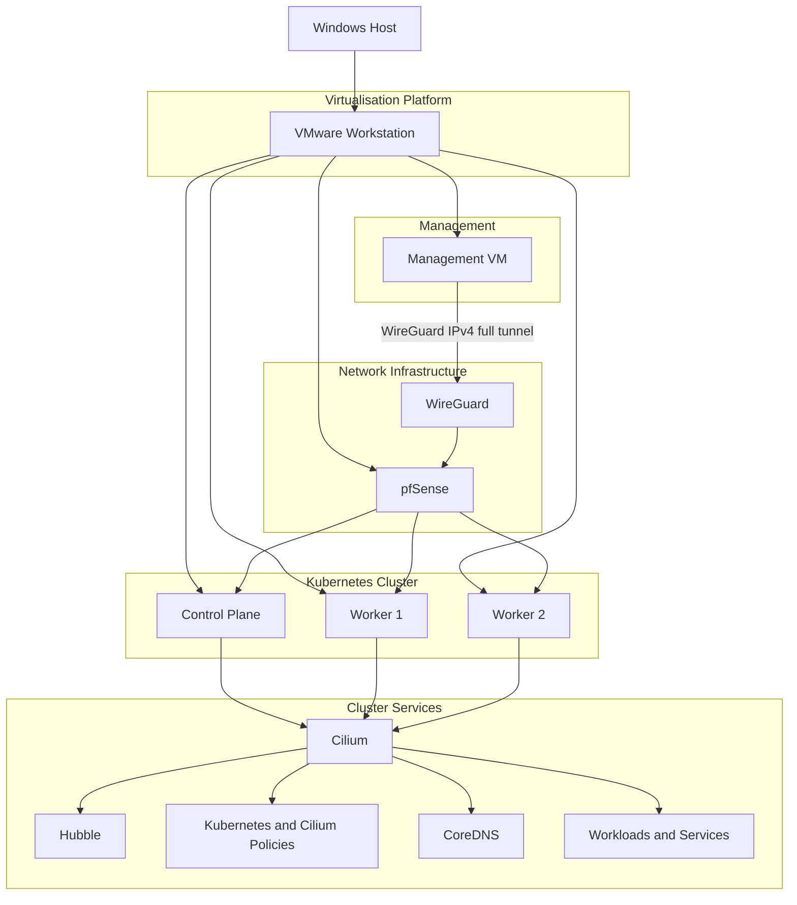

# k8s-cilium-lab

> A production-inspired Kubernetes networking homelab built with VMware Workstation, pfSense and Cilium.

This repository documents the design, deployment and validation of a production-inspired Kubernetes networking environment. The project focuses on Kubernetes networking, firewall segmentation and Linux-based administration while following a structured, phase-by-phase implementation approach.

The environment is intentionally built incrementally, with each completed phase documented and validated before introducing additional components. Only implemented features are documented, while planned capabilities are maintained separately as a project roadmap.

---

## Architecture

The following diagram provides a high-level overview of the lab environment and the relationship between its core components.

---

## Project Goals

The project is designed to build practical experience with Kubernetes networking while documenting each completed implementation phase.

* Build a production-inspired Kubernetes networking environment.
* Deploy and manage a Kubernetes cluster using `kubeadm`.
* Explore Cilium as an eBPF-based Container Network Interface.
* Design and validate network segmentation with pfSense.
* Implement and test Kubernetes and Cilium network policies.
* Practise Linux-based administration from a dedicated management workstation.
* Maintain concise, reproducible infrastructure documentation suitable for a technical portfolio.

---

## Technology Stack

The following technologies are currently used throughout the project.

| Category                    | Technology                                                                             |
| --------------------------- | -------------------------------------------------------------------------------------- |
| Hypervisor                  | VMware Workstation                                                                     |
| Firewall                    | pfSense CE                                                                             |
| Management Workstation      | Ubuntu Desktop 24.04 LTS                                                               |
| Kubernetes Nodes            | Ubuntu Server 24.04 LTS                                                                |
| Kubernetes Bootstrap        | kubeadm                                                                                |
| Container Runtime           | containerd                                                                             |
| Container Network Interface | Cilium                                                                                 |
| Cluster DNS                 | CoreDNS                                                                                |
| Observability               | Hubble Relay, UI and CLI                                                               |
| Network Policy              | Kubernetes `NetworkPolicy`, `CiliumNetworkPolicy` and `CiliumClusterwideNetworkPolicy` |
| Management VPN              | WireGuard                                                                              |
| Remote Administration       | OpenSSH                                                                                |
| Source Control              | Git and GitHub                                                                         |

---

## Implemented Components

The following components have been successfully deployed and validated.

* VMware-based lab networking configured.
* pfSense routing and firewalling operational.
* Dedicated management workstation deployed.
* WireGuard IPv4 full-tunnel VPN configured through pfSense.
* Three-node Kubernetes cluster deployed using `kubeadm`.
* One control plane node and two worker nodes running successfully.
* `containerd` configured as the container runtime.
* Cilium installed and operational with Kubernetes IPAM.
* `kube-proxy` retained with `kubeProxyReplacement=false`.
* CoreDNS running successfully.
* Hubble Relay, UI and CLI enabled and operational.
* Basic workload, Service and DNS networking validated.
* Kubernetes default-deny ingress and egress policies validated.
* Cilium namespace-aware ingress policies validated.
* DNS-aware and FQDN-based egress policies validated.
* Layer 7 HTTP method and path filtering validated.
* `CiliumClusterwideNetworkPolicy` validated across multiple namespaces.
* Explicit `ingressDeny` precedence over allow policies validated.
* Cross-node overlay traffic observed with Hubble.
* Live cluster manifests, status snapshots and validation scripts captured as repository artefacts.

---

## Documentation

Implementation phases:

1. [Phase 01 — Networking Foundation](docs/phase-01-networking.md)
2. [Phase 02 — Kubernetes Bootstrap](docs/phase-02-kubernetes-bootstrap.md)
3. [Phase 03 — Cilium Networking](docs/phase-03-cilium.md)
4. [Phase 04 — Hubble Observability](docs/phase-04-hubble.md)
5. [Phase 05 — Network Policies](docs/phase-05-network-policies.md)
6. [Phase 06 — WireGuard Full-Tunnel VPN](docs/phase-06-wireguard.md)
7. [Phase 07 — Repository Artefacts](docs/phase-07-repository-artefacts.md)
8. [Phase 08 — Advanced Cilium Policies](docs/phase-08-advanced-cilium-policies.md)

Architecture and troubleshooting:

* [Architecture](docs/architecture.md)
* [Invalid CiliumNetworkPolicy Default-Deny Attempt](docs/troubleshooting/invalid-cilium-network-policy.md)
* [Deployment Labels, Pod Templates and Cilium Identities](docs/troubleshooting/deployment-vs-pod-template-labels.md)

---

## Validation

The current lab state has been validated through cluster, networking, workload, observability, policy, VPN and repository checks.

Infrastructure and cluster:

* All Kubernetes nodes report `Ready`.
* Cilium agents and operator report a healthy status.
* Cilium runs across all Kubernetes nodes.
* CoreDNS pods are running.
* `kube-proxy` remains deployed.
* Basic Deployment, Service and DNS connectivity tests passed.

Observability:

* Hubble Relay and Hubble UI are running.
* `hubble observe` shows live flow output.
* Hubble shows `FORWARDED` and `DROPPED` policy verdicts.
* DNS proxy and Layer 7 HTTP flows are visible.
* Cross-node traffic shows `to-overlay` routing.

Network policy:

* Basic ingress and egress isolation was validated.
* Cross-namespace frontend-to-backend TCP/80 traffic is allowed.
* Untrusted cross-namespace traffic is denied.
* DNS through CoreDNS is allowed for the controlled frontend.
* `example.com` HTTPS access is allowed through `toFQDNs`.
* `github.com` DNS resolution succeeds while HTTPS access is denied.
* Internal backend access remains allowed by the FQDN egress policy.
* `GET /public` returns HTTP 200.
* `GET /admin` and `POST /public` return HTTP 403.
* The auditor client can reach protected backends across namespaces.
* The untrusted client cannot reach protected backends.
* Explicit `ingressDeny` overrides a matching allow policy.
* Namespaced and cluster-wide Cilium policies report `VALID=True`.

Management VPN:

* WireGuard handshake completed successfully.
* Internet IPv4 traffic from `mgmt` is routed through the WireGuard tunnel.
* pfSense Automatic Outbound NAT was validated for the WireGuard network.
* DNS resolution remained operational.
* The Kubernetes LAN is reachable from `mgmt` through WireGuard.

Repository artefacts:

* Exported manifests passed Kubernetes server-side dry-run.
* Validation scripts completed successfully.
* Cilium and Hubble evidence was captured from the working cluster.
* Repository artefacts were scanned for sensitive information.

---

## Roadmap

Remaining work in this repository:

1. **Phase 09 — Service Exposure**

   * Cilium LoadBalancer IPAM.
   * L2 Announcements.
   * BGP integration with pfSense.
2. **Phase 10 — Failure Scenarios and Troubleshooting**

   * Controlled networking and policy failures.
   * Evidence-based diagnosis and recovery.
3. **Phase 11 — Automation and Portfolio Polish**

   * Validation automation.
   * Makefile targets.
   * Final repository consistency checks.
   * Portfolio presentation improvements.

Broader GitOps, observability, security and application-platform work will be developed in separate focused repositories.

---

## Licence

This project is licensed under the MIT Licence. See the `LICENSE` file for details.
