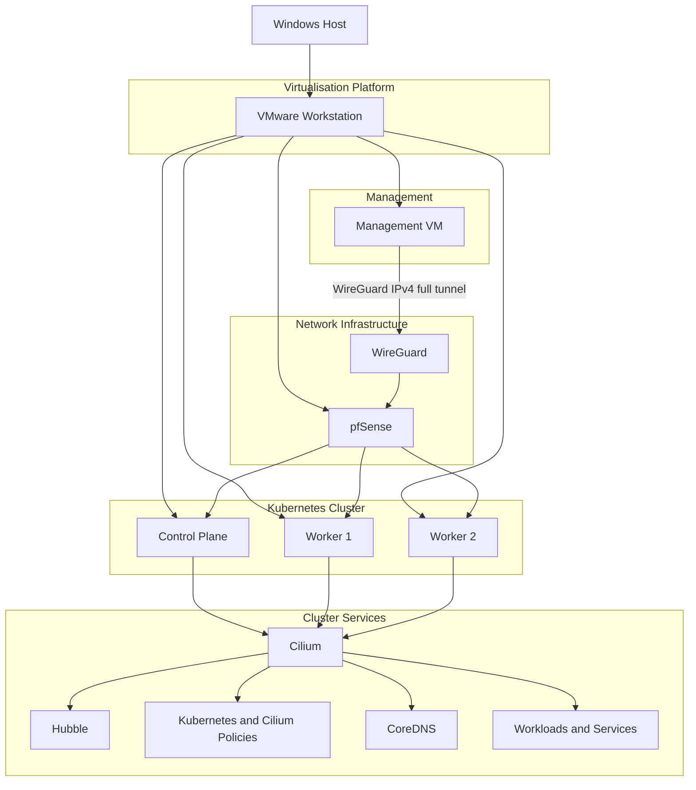

# k8s-cilium-lab

> A production-inspired Kubernetes networking homelab built with VMware Workstation, pfSense and Cilium.

This repository documents the design, deployment and validation of a production-inspired Kubernetes networking environment. The project focuses on Kubernetes networking, firewall segmentation and Linux-based administration while following a structured, phase-by-phase implementation approach.

The environment is intentionally built incrementally, with each completed phase documented and validated before introducing additional components. Only implemented features are documented, while planned capabilities are maintained separately as a project roadmap.

---

## Architecture

The following diagram provides a high-level overview of the lab environment and the relationship between its core components.

---

## Project Goals

The project is designed to build practical experience with Kubernetes networking while documenting each completed implementation phase.

* Build a production-inspired Kubernetes networking environment.
* Deploy and manage a Kubernetes cluster using `kubeadm`.
* Explore Cilium as an eBPF-based Container Network Interface.
* Design and validate network segmentation with pfSense.
* Implement and test Kubernetes and Cilium network policies.
* Practise Linux-based administration from a dedicated management workstation.
* Maintain concise, reproducible infrastructure documentation suitable for a technical portfolio.

---

## Technology Stack

The following technologies are currently used throughout the project.

| Category                    | Technology                                                                             |
| --------------------------- | -------------------------------------------------------------------------------------- |
| Hypervisor                  | VMware Workstation                                                                     |
| Firewall                    | pfSense CE                                                                             |
| Management Workstation      | Ubuntu Desktop 24.04 LTS                                                               |
| Kubernetes Nodes            | Ubuntu Server 24.04 LTS                                                                |
| Kubernetes Bootstrap        | kubeadm                                                                                |
| Container Runtime           | containerd                                                                             |
| Container Network Interface | Cilium                                                                                 |
| Cluster DNS                 | CoreDNS                                                                                |
| Observability               | Hubble Relay, UI and CLI                                                               |
| Network Policy              | Kubernetes `NetworkPolicy`, `CiliumNetworkPolicy` and `CiliumClusterwideNetworkPolicy` |
| Management VPN              | WireGuard                                                                              |
| Remote Administration       | OpenSSH                                                                                |
| Source Control              | Git and GitHub                                                                         |
| Service Exposure            | Cilium LB IPAM, L2 Announcements and BGP Control Plane v2 |
| Dynamic Routing             | pfSense FRR                                              |

---

## Implemented Components

The following components have been successfully deployed and validated.

* VMware-based lab networking configured.
* pfSense routing and firewalling operational.
* Dedicated management workstation deployed.
* WireGuard IPv4 full-tunnel VPN configured through pfSense.
* Three-node Kubernetes cluster deployed using `kubeadm`.
* One control plane node and two worker nodes running successfully.
* `containerd` configured as the container runtime.
* Cilium installed and operational.
* Cilium kube-proxy replacement enabled.
* The legacy `kube-proxy` DaemonSet object remains present and is reported by validation as a warning.
* Hubble Relay and Hubble UI enabled and operational.
* Kubernetes NetworkPolicy, CiliumNetworkPolicy and CiliumClusterwideNetworkPolicy behaviour validated.
* Cross-namespace, DNS-aware, FQDN, Layer 7, cluster-wide and explicit-deny policies validated.
* Cilium LoadBalancer IPAM configured with dedicated LAN and BGP VIP pools.
* Cilium L2 Announcements configured for the LAN Service VIP `10.10.10.200`.
* Lease-based L2 ownership failover validated between both worker nodes.
* Cilium BGP Control Plane v2 integrated with pfSense FRR.
* BGP peering validated between pfSense ASN `64512` and Cilium ASN `64513`.
* The Service VIP `10.30.0.100/32` is advertised through both worker nodes.
* Controlled BGP path withdrawal and recovery completed without HTTP interruption.
* Repository manifests, runtime snapshots and validation scripts derived from the working lab.
* One minimal, controlled `CiliumNetworkPolicy` troubleshooting scenario completed.
* A syntactically valid but logically incorrect endpoint selector was diagnosed through Cilium datapath and endpoint evidence.
* Selective access was restored by correcting `access=approve` to `access=approved`.
* Temporary Phase 10 resources were removed and the cluster, L2 and BGP baselines were revalidated.
* Static Phase 10 evidence validation completed successfully.

---

## Documentation

Implementation details are organised by completed project phase:

1. [Phase 01 — Networking Foundation](docs/phase-01-networking.md)
2. [Phase 02 — Kubernetes Bootstrap](docs/phase-02-kubernetes-bootstrap.md)
3. [Phase 03 — Cilium Networking](docs/phase-03-cilium.md)
4. [Phase 04 — Hubble Observability](docs/phase-04-hubble.md)
5. [Phase 05 — Network Policies](docs/phase-05-network-policies.md)
6. [Phase 06 — WireGuard Full-Tunnel VPN](docs/phase-06-wireguard.md)
7. [Phase 07 — Repository Artefacts](docs/phase-07-repository-artefacts.md)
8. [Phase 08 — Advanced Cilium Policies](docs/phase-08-advanced-cilium-policies.md)
9. [Phase 09 — Cilium Service Exposure](docs/phase-09-service-exposure.md)
10. [Phase 10 — Controlled NetworkPolicy Troubleshooting](docs/phase-10-controlled-networkpolicy-troubleshooting.md)

The detailed current-state design is documented in:

* [Architecture](docs/architecture.md)

Validated troubleshooting cases are documented under:

* [Invalid Cilium Network Policy](docs/troubleshooting/invalid-cilium-network-policy.md)
* [Deployment Labels, Pod Templates and Cilium Identities](docs/troubleshooting/deployment-vs-pod-template-labels.md)
* [CiliumNetworkPolicy Selector Mismatch](docs/troubleshooting/ciliumnetworkpolicy-selector-mismatch.md)

---

## Validation

The current lab state has been validated through cluster, networking, workload, observability, policy, VPN and service-exposure checks.

* All Kubernetes nodes report `Ready`.
* Cilium reports a healthy status.
* Cilium kube-proxy replacement reports enabled.
* The remaining legacy `kube-proxy` DaemonSet is detected and reported explicitly.
* Hubble Relay and Hubble UI are running.
* CoreDNS and Kubernetes service discovery are operational.
* Basic and advanced network policy scenarios produced the expected allowed and denied results.
* Hubble captured forwarded, dropped, proxied and cross-node flows.
* WireGuard IPv4 full-tunnel routing and pfSense outbound NAT were validated.
* LoadBalancer IPAM allocated the expected LAN and BGP VIPs.
* The L2 VIP `10.10.10.200` returned HTTP 200 before and after Lease failover.
* L2 Lease ownership moved from `k8s-worker1` to `k8s-worker2`.
* Both worker nodes established BGP sessions with pfSense FRR.
* pfSense received two routes to `10.30.0.100/32` during normal operation.
* One BGP route remained available during controlled path withdrawal.
* Both BGP routes returned after recovery.
* The BGP VIP returned HTTP 200 before, during and after failover.
* Phase 9 manifests passed Kubernetes server-side dry-run validation.
* Automated Phase 9 validation completed with zero failures.
* A healthy cluster and service-exposure baseline was recorded before the Phase 10 test.
* Both isolated clients reached the backend before ingress policy enforcement.
* A valid policy containing the incorrect selector `access=approve` denied both clients.
* The backend workload, Service and EndpointSlice remained healthy during the failure.
* Cilium recorded TCP SYN drops with the `Policy denied` verdict.
* Backend endpoint inspection confirmed ingress enforcement and the installed incorrect selector.
* Correcting the selector to `access=approved` restored HTTP 200 for the intended client.
* The non-matching client remained denied after the correction.
* All temporary Phase 10 resources were removed.
* All Kubernetes nodes, Cilium, both BGP peers and both LoadBalancer VIPs were healthy after cleanup.
* Static Phase 10 evidence validation completed with zero failures and one documented warning.

---

## Roadmap

The remaining work for this repository is:

1. Phase 11 — automation, validation improvements, Makefile and final portfolio polish.

GitOps, application delivery, observability and broader security capabilities are intentionally handled in separate projects rather than expanding this repository indefinitely.

---

## Licence

This project is licensed under the MIT Licence. See the `LICENSE` file for details.
