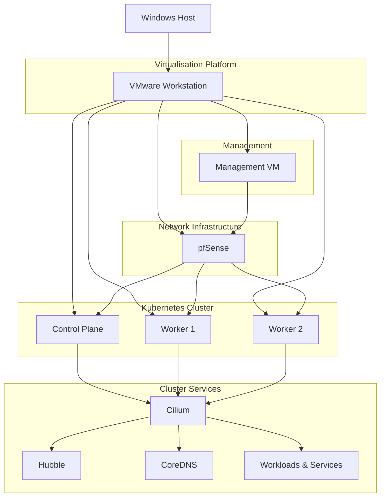

# k8s-cilium-lab

> A production-inspired Kubernetes networking homelab built with VMware Workstation, pfSense and Cilium.

This repository documents the design, deployment and validation of a production-inspired Kubernetes networking environment. The project focuses on Kubernetes networking, firewall segmentation and Linux-based administration while following a structured, phase-by-phase implementation approach.

The environment is intentionally built incrementally, with each completed phase documented and validated before introducing additional components. Only implemented features are documented, while planned capabilities are maintained separately as a project roadmap.

---

## Architecture

The following diagram provides a high-level overview of the lab environment and the relationship between its core components.

---

## Project Goals

The project is designed to build practical experience with Kubernetes networking while documenting each completed implementation phase.

* Build a production-inspired Kubernetes networking environment.
* Deploy and manage a Kubernetes cluster using `kubeadm`.
* Explore Cilium as an eBPF-based Container Network Interface (CNI).
* Design and validate network segmentation with pfSense.
* Practise Linux-based administration from a dedicated management workstation.
* Maintain concise, reproducible infrastructure documentation suitable for a technical portfolio.

---

## Technology Stack

The following technologies are currently used throughout the project.

| Category                    | Technology               |
| --------------------------- | ------------------------ |
| Hypervisor                  | VMware Workstation       |
| Firewall                    | pfSense CE               |
| Management Workstation      | Ubuntu Desktop 24.04 LTS |
| Kubernetes Nodes            | Ubuntu Server 24.04 LTS  |
| Kubernetes Bootstrap        | kubeadm                  |
| Container Runtime           | containerd               |
| Container Network Interface | Cilium                   |
| Cluster DNS                 | CoreDNS                  |
| Remote Administration       | OpenSSH                  |
| Source Control              | Git & GitHub             |

---

## Implemented Components

The following components have been successfully deployed and validated.

* VMware-based lab networking configured.
* pfSense routing and firewalling operational.
* Dedicated management workstation deployed.
* Three-node Kubernetes cluster deployed using `kubeadm`.
* One control plane node and two worker nodes running successfully.
* `containerd` configured as the container runtime.
* Cilium installed and operational.
* Hubble enabled and operational.
* CoreDNS running successfully.
* Basic workload networking validated.

---

## Validation

The current lab state has been validated through cluster, networking and workload checks.

* All Kubernetes nodes report `Ready`.
* Cilium reports a healthy status.
* Cilium runs across all Kubernetes nodes.
* Hubble Relay is running.
* Hubble UI is running.
* `hubble observe` shows live flow output.
* Hubble UI is accessible from the management workstation through an SSH tunnel.
* CoreDNS pods are running.
* A test `nginx` deployment was created successfully.
* A ClusterIP service was tested successfully.
* DNS resolution from a test pod was verified.
* Pod-to-service connectivity was verified.

---

## Roadmap

Planned future work is tracked separately from implemented functionality.

1. Cilium Network Policies
2. WireGuard
3. NFS storage
4. Argo CD
5. cert-manager
6. Prometheus
7. Grafana
8. Load balancing / BGP
9. Vault
10. Falco

---

## Licence

This project is licensed under the MIT Licence. See the `LICENSE` file for details.
