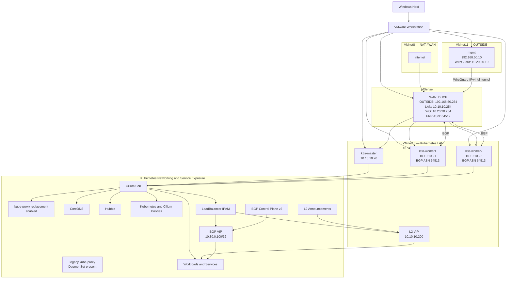
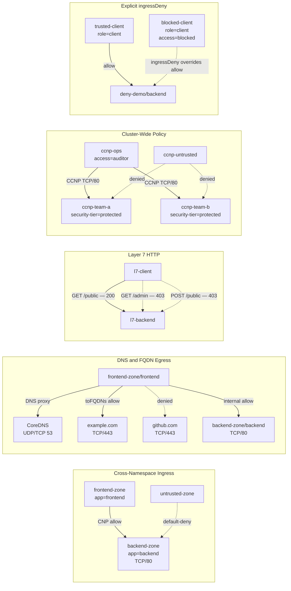
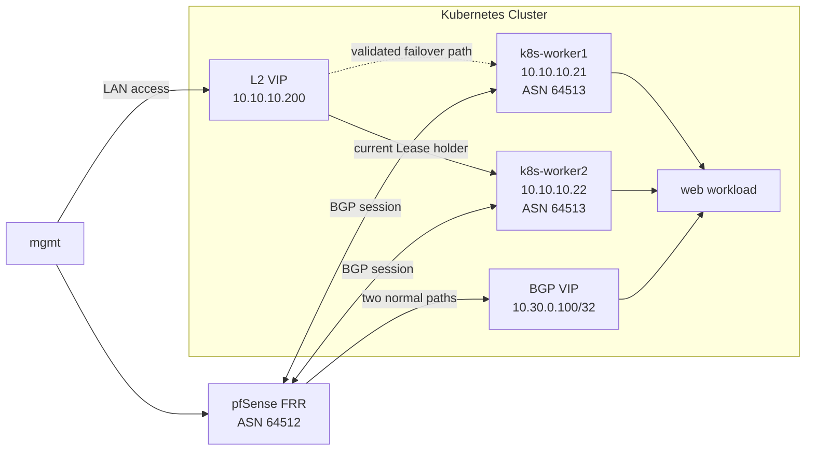

# Architecture

This document describes the current architecture of the `k8s-cilium-lab` environment. It covers the implemented virtual networks, pfSense routing, WireGuard management path, Kubernetes networking, Cilium policy model, LoadBalancer service exposure and Hubble observability.

Only components that have been implemented and practically validated are presented as part of the current architecture.

---

## Overview

The lab is built on VMware Workstation and uses pfSense as the routing, firewall and FRR boundary between the management network, the Kubernetes LAN and the upstream VMware NAT network.

Administration is performed from a dedicated management VM. Kubernetes nodes are placed on a separate LAN behind pfSense, with Cilium providing pod networking, policy enforcement, kube-proxy replacement and LoadBalancer service exposure.



The legacy `kube-proxy` DaemonSet object remains present. Automated validation reports this condition explicitly while confirming that Cilium kube-proxy replacement is enabled.

## VMware Networks

| VMware Network | Purpose                        | Subnet               |
| -------------- | ------------------------------ | -------------------- |
| VMnet8         | NAT and internet uplink        | DHCP from VMware NAT |
| VMnet11        | OUTSIDE and management network | `192.168.50.0/24`    |
| VMnet10        | Kubernetes node LAN            | `10.10.10.0/24`      |

VMware provides the virtual switching layer.

pfSense provides routed connectivity and firewall control between:

* the upstream VMware NAT network;
* the OUTSIDE management network;
* the Kubernetes LAN;
* the WireGuard VPN network.

---

## pfSense Interfaces

| Interface Role | Purpose                            | Addressing          |
| -------------- | ---------------------------------- | ------------------- |
| WAN            | Internet uplink through VMware NAT | DHCP                |
| OUTSIDE        | Management-side network            | `192.168.50.254/24` |
| LAN            | Kubernetes node network            | `10.10.10.254/24`   |
| WG             | WireGuard management VPN           | `10.20.20.254/24`   |

The lab uses `.254` as the gateway address on routed internal networks.

---

## Virtual Machine Inventory

| VM            | Role                     | Address                                  |
| ------------- | ------------------------ | ---------------------------------------- |
| `mgmt`        | Management workstation   | `192.168.50.10`, WireGuard `10.20.20.10` |
| `k8s-master`  | Kubernetes control plane | `10.10.10.20`                            |
| `k8s-worker1` | Kubernetes worker node   | `10.10.10.21`                            |
| `k8s-worker2` | Kubernetes worker node   | `10.10.10.22`                            |

The Windows host is used as the VMware Workstation host.

Daily administration is performed from the `mgmt` VM.

---

## IP Plan

| Address or network | Purpose | Routing or ownership |
|---|---|---|
| `192.168.50.0/24` | OUTSIDE management network | pfSense gateway `192.168.50.254` |
| `10.10.10.0/24` | Kubernetes node LAN | pfSense gateway `10.10.10.254` |
| `10.20.20.0/24` | WireGuard management VPN | pfSense gateway `10.20.20.254` |
| `10.10.10.200` | L2-announced LoadBalancer Service VIP | Cilium LB IPAM and L2 Announcements |
| `10.30.0.100/32` | BGP-advertised LoadBalancer Service VIP | Cilium BGP Control Plane v2 and pfSense FRR |

Kubernetes node addressing is static.

DHCP is not used on the Kubernetes LAN.

Ubuntu systems use:

```text
1.1.1.1
8.8.8.8
```

as their configured external DNS resolvers.

Inside Kubernetes, CoreDNS provides workload and Service name resolution.

## Infrastructure Traffic Model

The management path is:

```text
Windows Host
  ↓
VMware Workstation
  ↓
mgmt VM
  ↓
WireGuard
  ↓
pfSense
  ↓
Kubernetes LAN
  ↓
Kubernetes nodes and workloads
```

The validated LoadBalancer exposure paths are:

```text
L2:
mgmt or LAN client
  → 10.10.10.200
  → current Cilium L2 Lease holder
  → web Service backend
```

```text
BGP:
mgmt
  → pfSense FRR
  → 10.30.0.100/32
  → k8s-worker1 or k8s-worker2
  → web Service backend
```

Key design points:

* The `mgmt` VM is the administrative entry point.
* pfSense controls routed traffic between internal lab networks.
* pfSense FRR peers with both Kubernetes worker nodes.
* Kubernetes nodes use pfSense as their default gateway.
* Node-to-node communication occurs on the Kubernetes LAN.
* Cilium provides pod networking, policy enforcement and kube-proxy replacement.
* Cilium LoadBalancer IPAM allocates the validated Service VIPs.
* Cilium L2 Announcements provide LAN ownership for `10.10.10.200`.
* Cilium BGP Control Plane v2 advertises `10.30.0.100/32` to pfSense.
* CoreDNS provides Kubernetes Service discovery.
* Hubble provides flow and policy visibility.
* The legacy `kube-proxy` DaemonSet object remains present and is reported as a validation warning.

## Firewall Policy Summary

The OUTSIDE interface policy is intentionally restrictive and permits only required management access.

Implemented OUTSIDE access:

| Source      | Destination             | Purpose                       |
| ----------- | ----------------------- | ----------------------------- |
| `HOST_MGMT` | pfSense HTTPS           | Firewall administration       |
| `HOST_MGMT` | pfSense ICMP            | Reachability testing          |
| `HOST_MGMT` | Kubernetes nodes TCP/22 | SSH administration            |
| `HOST_MGMT` | Kubernetes API TCP/6443 | Cluster administration        |
| `HOST_MGMT` | Any                     | Management VM outbound access |

LAN access:

| Source         | Destination | Purpose                                    |
| -------------- | ----------- | ------------------------------------------ |
| Kubernetes LAN | Any         | Node outbound connectivity through pfSense |

WireGuard access:

| Source      | Destination               | Purpose                                  |
| ----------- | ------------------------- | ---------------------------------------- |
| `HOST_MGMT` | pfSense OUTSIDE UDP/51820 | WireGuard tunnel establishment           |
| `NET_WG`    | Any IPv4 destination      | Full-tunnel internal and internet access |

All other traffic is denied by the applicable implicit firewall policy.

---

## WireGuard Full-Tunnel VPN

WireGuard provides an encrypted IPv4 traffic path from the `mgmt` VM through pfSense.

| Setting           | Value                          |
| ----------------- | ------------------------------ |
| WireGuard network | `10.20.20.0/24`                |
| pfSense address   | `10.20.20.254`                 |
| `mgmt` address    | `10.20.20.10`                  |
| Endpoint          | `192.168.50.254:51820`         |
| Transport         | UDP/51820                      |
| Routing model     | IPv4 full tunnel               |
| Outbound NAT      | pfSense Automatic Outbound NAT |

The `mgmt` peer uses:

```text
AllowedIPs = 0.0.0.0/0
```

All IPv4 traffic from `mgmt` is routed through WireGuard.

pfSense then routes traffic to:

* the Kubernetes LAN;
* other internal destinations;
* the WAN and internet.

```text
mgmt
  → WireGuard
  → pfSense
  ├── Kubernetes LAN
  └── WAN / Internet
```

The WireGuard endpoint remains reachable through the OUTSIDE network so that the tunnel’s outer UDP traffic can reach pfSense.

DNS is not configured in `wg0.conf`. The existing operating system network configuration remains responsible for management VM name resolution.

The WireGuard implementation is currently IPv4 only.

---

## Kubernetes Cluster

The cluster was bootstrapped with `kubeadm` and consists of one control plane node and two worker nodes.

| Component | Current State |
|---|---|
| Control plane | Running on `k8s-master` |
| Worker nodes | `k8s-worker1`, `k8s-worker2` |
| Kubernetes version | `v1.36.1` |
| Container runtime | `containerd` |
| CNI | Cilium |
| Pod IPAM | Kubernetes IPAM |
| Service proxy | Cilium kube-proxy replacement enabled |
| Legacy kube-proxy DaemonSet | Present |
| LoadBalancer IPAM | Enabled |
| L2 Announcements | Enabled |
| BGP Control Plane | v2, peering with pfSense FRR |
| Cluster DNS | CoreDNS |
| Observability | Hubble Relay, UI and CLI |
| Policy resources | `NetworkPolicy`, `CiliumNetworkPolicy`, `CiliumClusterwideNetworkPolicy` |

The current validated Cilium state includes:

```text
ipam.mode=kubernetes
kube-proxy-replacement=true
```

The legacy `kube-proxy` DaemonSet object remains present. The repository does not claim that it has been removed.

The two LoadBalancer Services validated in Phase 9 use:

```text
10.10.10.200
10.30.0.100
```

## Kubernetes Networking Model

Cilium provides:

* pod-to-pod networking;
* pod-to-Service connectivity;
* Cilium kube-proxy replacement;
* LoadBalancer IP address allocation;
* L2 Service advertisement;
* BGP Service advertisement;
* namespace-aware policy enforcement;
* DNS-aware egress filtering;
* FQDN-based access control;
* Layer 7 HTTP filtering;
* cluster-wide policy enforcement;
* explicit deny rules;
* endpoint identities used for policy selection.

CoreDNS provides DNS resolution for:

* Kubernetes Services;
* namespace-qualified Service names;
* external names requested by workloads.

Hubble provides evidence of:

* `FORWARDED` flows;
* `DROPPED` flows;
* DNS proxy requests;
* HTTP Layer 7 requests and responses;
* policy decisions;
* cross-node `to-overlay` routing.

Cilium and pfSense FRR operational state provide additional evidence for:

* LoadBalancer VIP allocation;
* L2 Lease ownership;
* established BGP sessions;
* advertised Service routes;
* route withdrawal and recovery.

## Advanced Policy Architecture

Phase 08 introduced five isolated policy scenarios.



---

## Policy Resource Roles

| Resource                         | Purpose                                                     |
| -------------------------------- | ----------------------------------------------------------- |
| Kubernetes `NetworkPolicy`       | Simple default-deny ingress and egress isolation            |
| `CiliumNetworkPolicy`            | Namespace-aware, DNS, FQDN, Layer 7 and explicit-deny rules |
| `CiliumClusterwideNetworkPolicy` | Policy selection and enforcement across namespaces          |
| Hubble                           | Flow, verdict, proxy and routing evidence                   |

Standard Kubernetes `NetworkPolicy` is used where simple default-deny behaviour is required.

Cilium-specific resources are used where the policy requires:

* namespace identities;
* DNS proxy integration;
* `toFQDNs`;
* HTTP method or path filtering;
* cluster-wide endpoint selection;
* `ingressDeny`.

---

## Cross-Namespace Ingress

The backend in `backend-zone` is selected by:

```text
app=backend
```

A standard Kubernetes `NetworkPolicy` provides default-deny ingress.

A `CiliumNetworkPolicy` permits TCP/80 only from:

```text
namespace: frontend-zone
pod label: app=frontend
```

Validated result:

```text
frontend-zone  → backend-zone: ALLOWED
untrusted-zone → backend-zone: DENIED
```

---

## DNS and FQDN Egress

The `frontend-controlled-egress` policy permits:

* DNS to CoreDNS over UDP/53;
* DNS to CoreDNS over TCP/53;
* HTTPS to `example.com` over TCP/443;
* internal TCP/80 traffic to the backend in `backend-zone`.

DNS resolution and application traffic are evaluated separately.

This produces the validated behaviour:

```text
example.com DNS:      ALLOWED
example.com TCP/443:  ALLOWED
github.com DNS:       ALLOWED
github.com TCP/443:   DENIED
internal backend:     ALLOWED
```

Pods use the Kubernetes resolver configuration with:

```text
options ndots:5
```

Names with fewer than five dots may first be queried with Kubernetes search suffixes such as:

```text
<namespace>.svc.cluster.local
svc.cluster.local
cluster.local
```

These additional DNS requests are expected and are visible through the Cilium DNS proxy and Hubble.

---

## Layer 7 HTTP Enforcement

The `l7-demo` namespace contains:

* `l7-client`;
* `l7-backend`;
* the `l7-backend` Service;
* the `l7-nginx-config` ConfigMap.

The `allow-public-get-only` policy permits only:

```text
GET /public
```

Validated result:

```text
GET  /public → HTTP 200
GET  /admin  → HTTP 403
POST /public → HTTP 403
```

Hubble shows:

* the allowed request as `FORWARDED`;
* denied requests as policy drops;
* proxy-generated HTTP 403 responses returning to the client.

A forwarded 403 response represents the proxy delivering a denial response. It does not mean that the original request was permitted.

---

## Cluster-Wide Policy

The cluster-wide policy selects backend pods with:

```text
security-tier=protected
```

The authorised operational client uses:

```text
access=auditor
```

One `CiliumClusterwideNetworkPolicy` permits the auditor to reach protected backends on TCP/80 across both team namespaces.

Validated result:

```text
auditor → ccnp-team-a/backend: ALLOWED
auditor → ccnp-team-b/backend: ALLOWED

untrusted → ccnp-team-a/backend: DENIED
untrusted → ccnp-team-b/backend: DENIED
```

Hubble also showed `to-overlay` traffic for cross-node communication.

---

## Explicit Deny

The `deny-demo` scenario separates the general allow rule from the explicit deny rule.

The allow policy permits:

```text
role=client → backend TCP/80
```

The deny policy rejects:

```text
access=blocked → backend TCP/80
```

Validated result:

```text
trusted-client: ALLOWED
blocked-client: DENIED
```

The blocked client matches the general allow rule and the explicit deny rule.

The explicit deny rule takes precedence, even when the allow and deny rules are defined in separate Cilium policy objects.

---

## Cilium Identities and Pod Labels

Cilium applies policy to pod endpoints and their identities.

For Deployment-managed workloads, policy-relevant labels must exist under:

```text
spec.template.metadata.labels
```

Adding a label only to:

```text
metadata.labels
```

on the Deployment object does not add that label to the pods.

After the pod templates were corrected:

* Kubernetes created replacement pods;
* the new pods received the required labels;
* Cilium assigned identities based on the corrected label sets;
* the policy selectors matched as expected.

Older Hubble `DENIED` events were associated with earlier pods that did not contain the required labels.

Current policy diagnosis must therefore consider:

* event timestamps;
* pod names;
* pod lifecycle;
* endpoint identities;
* labels present when the event occurred.

---

## Service Exposure Architecture

Phase 09 exposes Kubernetes Services through two complementary Cilium mechanisms:

* L2 Announcements for a Service VIP located directly on the Kubernetes LAN;
* BGP Control Plane v2 for a routed Service VIP advertised to pfSense FRR.

Cilium LoadBalancer IPAM allocates addresses from two dedicated pools.

| Pool | Purpose |
|---|---|
| `k8s-lan-pool` | LAN-reachable LoadBalancer addresses |
| `bgp-vip-pool` | Service addresses advertised through BGP |

The validated Services are:

| Service | Exposure | VIP |
|---|---|---|
| `lb-ipam-demo/web` | Cilium L2 Announcement | `10.10.10.200` |
| `lb-ipam-demo/web-bgp` | Cilium BGP Control Plane v2 | `10.30.0.100/32` |

Both Services select the same validated web Deployment.



### LoadBalancer IPAM

Two `CiliumLoadBalancerIPPool` objects provide the validated addresses:

```text
k8s-lan-pool
bgp-vip-pool
```

The LAN pool assigned `10.10.10.200` to `lb-ipam-demo/web`.

The BGP pool assigned `10.30.0.100` to `lb-ipam-demo/web-bgp`.

Both Services had ready EndpointSlice backends and returned HTTP 200 during validation.

### L2 Announcement and Lease Ownership

The L2 Service is controlled by:

```text
CiliumL2AnnouncementPolicy/lan-loadbalancer-services
```

Cilium maintains:

```text
cilium-l2announce-lb-ipam-demo-web
```

as the Lease for the L2-announced Service.

The controlled failover changed the holder from:

```text
k8s-worker1
```

to:

```text
k8s-worker2
```

The client-facing VIP remained `10.10.10.200` and returned HTTP 200 before and after the ownership change.

The original policy selector was restored and temporary labels were removed after validation.

### BGP Control Plane v2

The declarative BGP resources are:

```text
CiliumBGPClusterConfig/pfsense-bgp
CiliumBGPPeerConfig/pfsense-peer
CiliumBGPAdvertisement/pfsense-service-vips
```

Cilium generated runtime node configurations for:

```text
CiliumBGPNodeConfig/k8s-worker1
CiliumBGPNodeConfig/k8s-worker2
```

No `CiliumBGPNodeConfigOverride` objects are configured.

The validated Autonomous System assignments are:

| System | ASN |
|---|---:|
| pfSense FRR | `64512` |
| Cilium worker nodes | `64513` |

During normal operation, pfSense receives two paths to:

```text
10.30.0.100/32
```

through:

```text
10.10.10.21
10.10.10.22
```

During the controlled failover, the path through `10.10.10.21` was withdrawn while the path through `10.10.10.22` remained available.

After recovery, both paths returned. The Service responded with HTTP 200 before, during and after failover.

### Kube-Proxy State

Cilium reports kube-proxy replacement as enabled.

The legacy Kubernetes `kube-proxy` DaemonSet object remains present. Automated validation reports this as a warning so that the repository accurately represents both parts of the current state.

The architecture does not claim that the legacy DaemonSet has been removed.

---

## Observability Model

Hubble Relay aggregates flow data from Cilium agents across the cluster.

Flow visibility is available through:

* Hubble CLI;
* Hubble Relay;
* Hubble UI through an SSH local port forward.

The Hubble UI access path is:

```text
mgmt browser
  → localhost:12000
  → SSH local port forward
  → k8s-master localhost:12000
  → cilium hubble ui
```

Useful evidence includes:

```text
FORWARDED
DROPPED
to-overlay
DNS proxy requests
HTTP methods and paths
HTTP 200 and 403 responses
```

Hubble snapshots are point-in-time evidence and do not replace live validation.

---

## Validation Snapshot

The current architecture has been validated with the following checks.

Infrastructure and cluster:

* pfSense has working upstream connectivity.
* `mgmt` can reach and administer pfSense.
* `mgmt` can SSH to all Kubernetes nodes.
* Kubernetes nodes can reach the internet through pfSense.
* All Kubernetes nodes report `Ready`.
* Cilium reports a healthy status.
* Cilium kube-proxy replacement reports enabled.
* The legacy `kube-proxy` DaemonSet remains present and is reported explicitly.
* CoreDNS is running.
* Workload, Service and DNS connectivity is operational.

Observability:

* Hubble Relay is running.
* Hubble UI is running.
* Hubble CLI returns live flow output.
* Hubble UI access through an SSH tunnel was validated.
* `FORWARDED` and `DROPPED` flows were captured.
* DNS proxy behaviour was observed.
* HTTP Layer 7 filtering was observed.
* Cross-node `to-overlay` traffic was observed.

Network policy:

* Basic default-deny ingress and egress behaviour was validated.
* Cross-namespace ingress selection was validated.
* DNS-aware and FQDN egress was validated.
* Layer 7 HTTP method and path filtering was validated.
* Cluster-wide policy was validated.
* Explicit `ingressDeny` precedence was validated.
* Namespaced and cluster-wide Cilium policies report `VALID=True`.

WireGuard:

* WireGuard IPv4 full-tunnel routing was validated.
* The Kubernetes LAN is reachable through WireGuard.
* Internet IPv4 traffic from `mgmt` traverses the WireGuard tunnel.
* Automatic Outbound NAT was confirmed for `10.20.20.0/24`.
* DNS resolution remains operational.

Service exposure:

* `k8s-lan-pool` and `bgp-vip-pool` are active without address conflicts.
* `lb-ipam-demo/web` uses the VIP `10.10.10.200`.
* `lb-ipam-demo/web-bgp` uses the VIP `10.30.0.100`.
* Both Services had ready backends.
* L2 Lease ownership moved from `k8s-worker1` to `k8s-worker2`.
* The L2 VIP returned HTTP 200 before and after failover.
* Both worker nodes established BGP sessions with pfSense FRR.
* pfSense received two paths to `10.30.0.100/32` before failover.
* The path through `10.10.10.22` remained during controlled failover.
* Both BGP paths returned after recovery.
* The BGP VIP returned HTTP 200 before, during and after failover.
* The original selectors were restored and temporary labels were removed.
* Automated Phase 9 validation completed with zero failures and one warning for the remaining legacy `kube-proxy` DaemonSet.

Repository artefacts:

* Live resources were exported and cleaned.
* Generated manifests passed server-side dry-run.
* Validation scripts completed successfully.
* Hubble and service-exposure evidence was captured.
* Repository artefacts were scanned for sensitive information.

## Current Scope

This document describes the architecture implemented and validated through Phase 09.

The remaining repository phases are:

1. **Phase 10 — Failure Scenarios and Troubleshooting**

   * Controlled failures.
   * Diagnosis and recovery evidence.
2. **Phase 11 — Automation and Portfolio Polish**

   * Validation automation.
   * Makefile targets.
   * Repository consistency checks.
   * Final portfolio presentation.

Broader GitOps, application delivery, observability and security work is intentionally handled in separate repositories.
