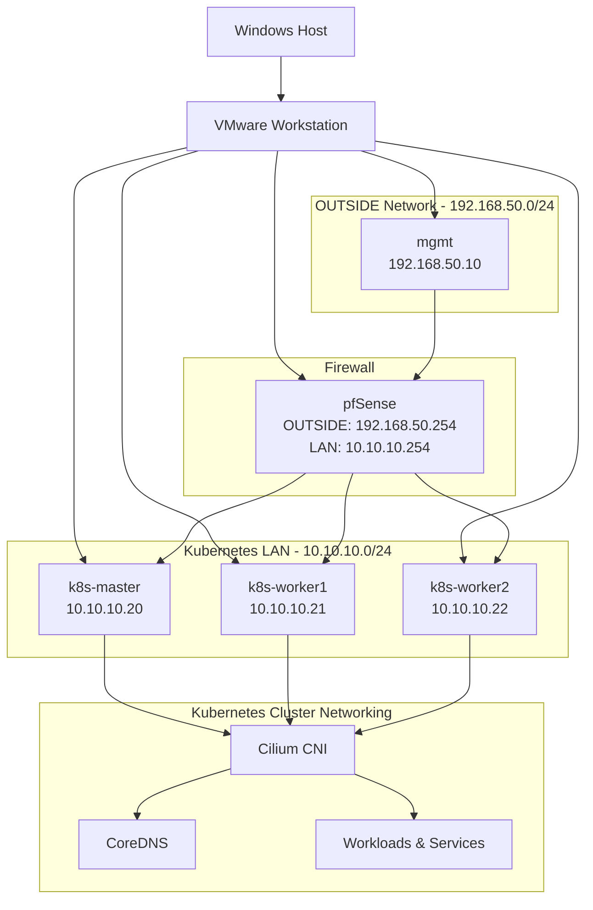

# Architecture

This document describes the current architecture of the `k8s-cilium-lab` environment. It focuses on the implemented network design, virtual machines, routing model and Kubernetes networking components.

---

## Overview

The lab is built on VMware Workstation and uses pfSense as the routing and firewall boundary between the management network and the Kubernetes LAN.

Administration is performed from a dedicated management VM. Kubernetes nodes are placed on a separate LAN behind pfSense, with Cilium providing Kubernetes cluster networking.



---

## VMware Networks

| VMware Network | Purpose                      | Subnet               |
| -------------- | ---------------------------- | -------------------- |
| VMnet8         | NAT / Internet uplink        | DHCP from VMware NAT |
| VMnet11        | OUTSIDE / management network | `192.168.50.0/24`    |
| VMnet10        | Kubernetes LAN               | `10.10.10.0/24`      |

VMware provides the virtual switching layer for the lab. pfSense provides routed connectivity between the OUTSIDE network, the Kubernetes LAN and the upstream NAT network.

---

## pfSense Interfaces

| Interface Role | Purpose                        | Addressing          |
| -------------- | ------------------------------ | ------------------- |
| WAN            | Internet uplink via VMware NAT | DHCP                |
| OUTSIDE        | Management-side network        | `192.168.50.254/24` |
| LAN            | Kubernetes node network        | `10.10.10.254/24`   |

pfSense uses `.254` as the gateway address on routed internal networks.

---

## Virtual Machine Inventory

| VM            | Role                     | Address         |
| ------------- | ------------------------ | --------------- |
| `mgmt`        | Management workstation   | `192.168.50.10` |
| `k8s-master`  | Kubernetes control plane | `10.10.10.20`   |
| `k8s-worker1` | Kubernetes worker node   | `10.10.10.21`   |
| `k8s-worker2` | Kubernetes worker node   | `10.10.10.22`   |

The Windows host is used only as the VMware Workstation host. Daily administration is performed from the `mgmt` VM.

---

## IP Plan

| Network           | Purpose                      | Gateway          |
| ----------------- | ---------------------------- | ---------------- |
| `192.168.50.0/24` | OUTSIDE / management network | `192.168.50.254` |
| `10.10.10.0/24`   | Kubernetes LAN               | `10.10.10.254`   |

Kubernetes node addressing is static. DHCP on the Kubernetes LAN is not used.

Ubuntu systems use the following DNS resolvers:

```text
1.1.1.1
8.8.8.8
```

---

## Traffic Model

The lab follows a segmented traffic model.

```text
Windows Host
  ↓
VMware Workstation
  ↓
mgmt VM
  ↓
pfSense
  ↓
Kubernetes LAN
  ↓
Kubernetes nodes and workloads
```

Key design points:

* The `mgmt` VM is the administrative entry point.
* pfSense controls routed traffic between the management network and the Kubernetes LAN.
* Kubernetes nodes use pfSense as their default gateway.
* Node-to-node communication occurs on the Kubernetes LAN.
* Cilium provides Kubernetes pod and service networking inside the cluster.

---

## Firewall Policy Summary

The OUTSIDE interface policy is intentionally restrictive and allows only required management access.

Implemented OUTSIDE access:

| Source      | Destination             | Purpose                       |
| ----------- | ----------------------- | ----------------------------- |
| `HOST_MGMT` | pfSense HTTPS           | Firewall administration       |
| `HOST_MGMT` | pfSense ICMP            | Reachability testing          |
| `HOST_MGMT` | Kubernetes nodes TCP/22 | SSH administration            |
| `HOST_MGMT` | Kubernetes API TCP/6443 | Cluster administration        |
| `HOST_MGMT` | Any                     | Management VM outbound access |

LAN access:

| Source         | Destination | Purpose                                    |
| -------------- | ----------- | ------------------------------------------ |
| Kubernetes LAN | Any         | Node outbound connectivity through pfSense |

All other traffic is denied by the implicit firewall policy.

---

## Kubernetes Networking

The Kubernetes cluster was bootstrapped with `kubeadm` and currently consists of one control plane node and two worker nodes.

| Component         | Current State                |
| ----------------- | ---------------------------- |
| Control plane     | Running on `k8s-master`      |
| Worker nodes      | `k8s-worker1`, `k8s-worker2` |
| Container runtime | `containerd`                 |
| CNI               | Cilium                       |
| Cluster DNS       | CoreDNS                      |
| kube-proxy        | Present                      |

Cilium is installed as the cluster CNI with Kubernetes IPAM enabled. Full kube-proxy replacement is not enabled at this stage.

---

## Validation Snapshot

The current architecture has been validated with the following checks:

* pfSense has working upstream connectivity.
* `mgmt` can reach pfSense.
* `mgmt` can SSH to all Kubernetes nodes.
* Kubernetes nodes can reach the internet through pfSense.
* All Kubernetes nodes report `Ready`.
* Cilium reports a healthy status.
* CoreDNS is running.
* A test workload and ClusterIP service were successfully validated.
* DNS resolution and pod-to-service connectivity were verified from inside the cluster.

---

## Current Scope

This document describes only the architecture that has already been implemented.

The following capabilities are planned for later phases and are not part of the current architecture:

* Hubble
* Cilium Network Policies
* WireGuard
* NFS storage
* Argo CD
* cert-manager
* Prometheus
* Grafana
* Load balancing / BGP
* Vault
* Falco
