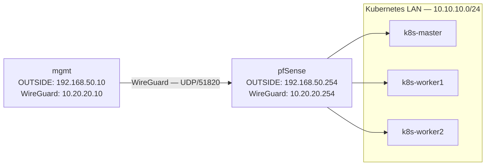

# Phase 06 — WireGuard Management VPN

This document describes the sixth completed phase of the lab: configuring WireGuard as a routed management VPN between the `mgmt` VM and pfSense.

---

## Scope

Phase 06 introduced encrypted management connectivity to the Kubernetes LAN.

Implemented in this phase:

* WireGuard package installed on pfSense.
* WireGuard tunnel created on pfSense.
* WireGuard installed on the `mgmt` VM.
* Cryptographic keys generated locally on each system.
* `mgmt` configured as a WireGuard peer.
* WireGuard interface assigned on pfSense.
* Firewall rules created for tunnel establishment and routed access.
* Split tunnelling configured.
* Access from `mgmt` to the Kubernetes LAN validated.
* Existing internet and DNS connectivity preserved.

NFS storage and the remaining roadmap items are not implemented in this phase.

---

## Traffic Model

WireGuard provides routed and encrypted management access from the `mgmt` VM to the Kubernetes LAN through pfSense.



---

## Addressing

| Component                   | Address           |
| --------------------------- | ----------------- |
| WireGuard network           | `10.20.20.0/24`   |
| pfSense WireGuard interface | `10.20.20.254/24` |
| `mgmt` WireGuard interface  | `10.20.20.10/24`  |
| WireGuard transport         | UDP/51820         |

The tunnel uses split tunnelling.

| Destination              | Route                                  |
| ------------------------ | -------------------------------------- |
| `10.20.20.0/24`          | WireGuard tunnel                       |
| `10.10.10.0/24`          | WireGuard tunnel                       |
| General internet traffic | Existing OUTSIDE route through pfSense |

The configuration intentionally does not route all internet traffic through WireGuard.

---

## pfSense Tunnel

The WireGuard package was installed through the pfSense Package Manager and enabled under the VPN configuration.

Tunnel configuration:

| Setting        | Value                             |
| -------------- | --------------------------------- |
| Description    | `WG_MGMT`                         |
| Listen port    | `51820`                           |
| Tunnel address | `10.20.20.254/24`                 |
| Key ownership  | Generated and retained on pfSense |

The pfSense public key was copied to the `mgmt` configuration. The pfSense private key remained on pfSense.

---

## Management VM Keys

WireGuard was installed on the `mgmt` VM:

```bash
sudo apt update
sudo apt install -y wireguard
```

The `mgmt` key pair was generated locally:

```bash
umask 077
wg genkey | tee ~/mgmt-wg-private.key | wg pubkey > ~/mgmt-wg-public.key
```

The public key was added to the pfSense peer configuration. The private key remained local to the `mgmt` VM.

The following security model was used:

```text
mgmt public key → pfSense peer
pfSense public key → mgmt WireGuard configuration
```

Private keys must not be committed to this repository.

---

## pfSense Peer

A peer representing the `mgmt` VM was added to the `WG_MGMT` tunnel.

| Setting              | Value             |
| -------------------- | ----------------- |
| Description          | `mgmt`            |
| Public key           | `mgmt` public key |
| Allowed IPs          | `10.20.20.10/32`  |
| Persistent keepalive | `25` seconds      |
| Endpoint             | Not configured    |

The endpoint was left empty on pfSense because the `mgmt` VM initiates the connection.

---

## Interface and Alias

The WireGuard tunnel was assigned as a pfSense interface named:

```text
WG
```

A network alias was created:

```text
NET_WG = 10.20.20.0/24
```

The existing WireGuard port alias was used:

```text
PORT_WG = 51820
```

---

## Firewall Policy

### OUTSIDE

The OUTSIDE interface permits the WireGuard handshake from the management VM.

| Setting          | Value                                |
| ---------------- | ------------------------------------ |
| Action           | Pass                                 |
| Protocol         | UDP                                  |
| Source           | `HOST_MGMT`                          |
| Destination      | pfSense OUTSIDE address              |
| Destination port | `PORT_WG`                            |
| Description      | Allow HOST_MGMT WireGuard to pfSense |

Permitted transport:

```text
192.168.50.10 → 192.168.50.254 UDP/51820
```

### WireGuard Interface

The WireGuard interface permits routed access from the VPN network to the Kubernetes LAN.

| Setting     | Value                      |
| ----------- | -------------------------- |
| Action      | Pass                       |
| Interface   | `WG`                       |
| Source      | `NET_WG`                   |
| Destination | `NET_K8S_LAN`              |
| Description | Allow WG to Kubernetes LAN |

ICMP from the WireGuard network to pfSense was also permitted for connectivity testing.

---

## Management VM Configuration

WireGuard is configured on the `mgmt` VM using:

```text
/etc/wireguard/wg0.conf
```

Configuration structure:

```ini
[Interface]
Address = 10.20.20.10/24
PrivateKey = <MGMT_PRIVATE_KEY>

[Peer]
PublicKey = <PFSENSE_TUNNEL_PUBLIC_KEY>
Endpoint = 192.168.50.254:51820
AllowedIPs = 10.20.20.0/24, 10.10.10.0/24
PersistentKeepalive = 25
```

The configuration must contain placeholders only when documented. Actual private key values must remain outside the repository.

`AllowedIPs` implements split tunnelling:

```text
10.20.20.0/24 → WireGuard
10.10.10.0/24 → WireGuard
```

The following configuration is intentionally not used:

```ini
AllowedIPs = 0.0.0.0/0
```

General internet traffic therefore continues to use the existing OUTSIDE network and pfSense gateway.

---

## Service Activation

The WireGuard tunnel was enabled and started using systemd:

```bash
sudo systemctl enable --now wg-quick@wg0
```

Verification commands:

```bash
sudo wg show
ip address show wg0
ip route get 10.10.10.20
```

---

## DNS Configuration Adjustment

After WireGuard was initially enabled, the `mgmt` VM temporarily lost internet connectivity.

The WireGuard configuration contained:

```ini
DNS = 1.1.1.1
```

This entry was removed from `/etc/wireguard/wg0.conf`, allowing the existing OUTSIDE network configuration to remain responsible for DNS resolution.

The tunnel was restarted:

```bash
sudo systemctl restart wg-quick@wg0
```

After the adjustment:

* Internet connectivity was restored.
* DNS resolution worked normally.
* WireGuard routing remained operational.
* Split tunnelling continued to work as intended.

---

## Validation

The WireGuard deployment was validated from the `mgmt` VM.

Commands used:

```bash
ping -c 3 1.1.1.1
getent hosts pkgs.k8s.io
ping -c 3 10.20.20.254
ping -c 3 10.10.10.20
sudo wg show
```

Validated successfully:

* Internet IPv4 connectivity remained available.
* DNS resolution remained operational.
* `mgmt` could reach the pfSense WireGuard address.
* `mgmt` could reach the Kubernetes control plane through WireGuard.
* WireGuard handshake completed successfully.
* WireGuard transmit and receive counters increased.
* Persistent keepalive was active.
* Routes to both WireGuard and Kubernetes networks used `wg0`.
* Internet traffic continued to use the normal OUTSIDE route.
* SSH access to Kubernetes nodes continued to work.

---

## Kubernetes Administration

`kubectl` was not installed on the `mgmt` VM during this phase.

Cluster administration continues through SSH to the control plane:

```bash
ssh master
kubectl get nodes
```

This is an intentional administration model rather than a WireGuard limitation. The VPN provides routed connectivity to the Kubernetes LAN, while local `kubectl` administration from `mgmt` remains deferred.

---

## Current State

The lab now has an encrypted management path from the `mgmt` VM to the Kubernetes LAN.

Current state:

* WireGuard installed on pfSense and `mgmt`.
* Routed WireGuard tunnel operational.
* Split tunnelling enabled.
* Internet and DNS connectivity preserved.
* pfSense WireGuard interface active.
* Firewall access restricted to the required source and networks.
* Kubernetes LAN reachable through WireGuard.
* SSH administration through the tunnel working.

---

## Checkpoint

`Phase 06 checkpoint passed`

WireGuard management connectivity has been installed, configured and validated. The environment is ready for the next roadmap item: NFS storage.
