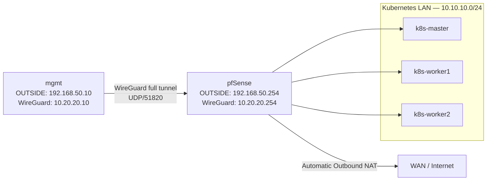

# Phase 06 — WireGuard Full-Tunnel VPN

This document describes the sixth completed phase of the lab: configuring WireGuard as an IPv4 full-tunnel VPN between the `mgmt` VM and pfSense.

---

## Scope

Phase 06 introduced encrypted management and internet connectivity through pfSense.

Implemented in this phase:

* WireGuard installed on pfSense and the `mgmt` VM.
* WireGuard tunnel configured between `mgmt` and pfSense.
* WireGuard interface assigned on pfSense.
* Firewall rules created for tunnel establishment and routed traffic.
* pfSense Automatic Outbound NAT verified for the WireGuard network.
* IPv4 full-tunnel routing enabled on `mgmt`.
* Kubernetes LAN access through WireGuard validated.
* Internet and DNS connectivity through the full-tunnel configuration validated.

NFS storage and the remaining roadmap items are not implemented in this phase.

---

## Traffic Model

All IPv4 traffic from the `mgmt` VM is routed through the encrypted WireGuard tunnel to pfSense.



Final routing model:

```text
All IPv4 traffic from mgmt
  → wg0
  → pfSense
  → internal destination or WAN
```

---

## Addressing

| Component                   | Address                |
| --------------------------- | ---------------------- |
| WireGuard network           | `10.20.20.0/24`        |
| pfSense WireGuard interface | `10.20.20.254/24`      |
| `mgmt` WireGuard interface  | `10.20.20.10/24`       |
| WireGuard endpoint          | `192.168.50.254:51820` |
| WireGuard transport         | UDP/51820              |

The tunnel is configured for IPv4 only.

---

## pfSense Tunnel

The WireGuard package was installed through the pfSense Package Manager.

Tunnel configuration:

| Setting        | Value                             |
| -------------- | --------------------------------- |
| Description    | `WG_MGMT`                         |
| Listen port    | `51820`                           |
| Tunnel address | `10.20.20.254/24`                 |
| Keys           | Generated and retained on pfSense |

The pfSense public key was added to the `mgmt` configuration. The private key remained on pfSense.

---

## Management Peer

The `mgmt` VM was added as a peer of the `WG_MGMT` tunnel.

| Setting              | Value             |
| -------------------- | ----------------- |
| Description          | `mgmt`            |
| Public key           | `mgmt` public key |
| Allowed IPs          | `10.20.20.10/32`  |
| Persistent keepalive | `25` seconds      |
| Endpoint             | Not configured    |

The endpoint was left empty on pfSense because the `mgmt` VM initiates the tunnel.

Private keys remain local to their respective systems and must never be committed to this repository.

---

## pfSense Interface and Alias

The WireGuard tunnel was assigned as a pfSense interface named:

```text
WG
```

The following alias represents the WireGuard network:

```text
NET_WG = 10.20.20.0/24
```

The existing WireGuard port alias is:

```text
PORT_WG = 51820
```

---

## Firewall Policy

### OUTSIDE

The OUTSIDE interface permits WireGuard handshake traffic from the management VM.

| Setting          | Value                                |
| ---------------- | ------------------------------------ |
| Action           | Pass                                 |
| Address family   | IPv4                                 |
| Protocol         | UDP                                  |
| Source           | `HOST_MGMT`                          |
| Destination      | pfSense OUTSIDE address              |
| Destination port | `PORT_WG`                            |
| Description      | Allow HOST_MGMT WireGuard to pfSense |

Permitted transport:

```text
192.168.50.10 → 192.168.50.254 UDP/51820
```

### WireGuard Interface

The WireGuard interface permits the VPN network to reach internal and external IPv4 destinations.

| Setting        | Value                            |
| -------------- | -------------------------------- |
| Action         | Pass                             |
| Interface      | `WG`                             |
| Address family | IPv4                             |
| Protocol       | Any                              |
| Source         | `NET_WG`                         |
| Destination    | Any                              |
| Description    | Allow NET_WG full tunnel traffic |

This permits access from the WireGuard client to:

* pfSense;
* the Kubernetes LAN;
* the internet through the pfSense WAN interface.

---

## Automatic Outbound NAT

pfSense remains configured in Automatic Outbound NAT mode.

The automatically generated NAT policy includes:

```text
10.20.20.0/24 → WAN address
```

No Hybrid Outbound NAT mode or manually created outbound NAT rule was required.

Internet-bound traffic from the `mgmt` WireGuard address is translated to the pfSense WAN address before leaving the lab.

---

## Management VM Configuration

WireGuard is configured on the `mgmt` VM using:

```text
/etc/wireguard/wg0.conf
```

Configuration structure:

```ini
[Interface]
Address = 10.20.20.10/24
PrivateKey = <MGMT_PRIVATE_KEY>

[Peer]
PublicKey = <PFSENSE_TUNNEL_PUBLIC_KEY>
Endpoint = 192.168.50.254:51820
AllowedIPs = 0.0.0.0/0
PersistentKeepalive = 25
```

Actual key values must not be included in the repository.

The full-tunnel route is enabled by:

```ini
AllowedIPs = 0.0.0.0/0
```

This sends all IPv4 traffic from `mgmt` through WireGuard.

DNS is intentionally not configured in `wg0.conf`. The existing operating system network configuration remains responsible for name resolution.

---

## Configuration Backup

The previous split-tunnel configuration was backed up before enabling the full tunnel:

```bash
sudo cp /etc/wireguard/wg0.conf \
  /etc/wireguard/wg0.conf.split-tunnel.backup
```

The backup remains local to the `mgmt` VM and is not stored in the repository.

---

## Service Activation

The tunnel is managed through systemd:

```bash
sudo systemctl enable --now wg-quick@wg0
```

After changing the routing configuration, the tunnel was restarted:

```bash
sudo systemctl restart wg-quick@wg0
```

Service and tunnel state were checked with:

```bash
sudo systemctl status wg-quick@wg0 --no-pager
sudo wg show
```

---

## Endpoint Behaviour

The WireGuard endpoint remains:

```text
192.168.50.254:51820
```

Although `AllowedIPs = 0.0.0.0/0` installs a full-tunnel route, connectivity to the WireGuard peer endpoint is preserved so that the tunnel's outer UDP traffic continues to use the OUTSIDE network.

---

## Validation

The IPv4 full tunnel was validated from the `mgmt` VM.

Commands used:

```bash
ping -c 3 10.20.20.254
ping -c 3 10.10.10.20
ping -c 3 1.1.1.1
getent hosts pkgs.k8s.io
curl -4 -I https://pkgs.k8s.io
sudo wg show
```

Validated successfully:

* WireGuard handshake completed.
* The pfSense WireGuard address was reachable.
* The Kubernetes LAN was reachable through WireGuard.
* Internet IPv4 connectivity worked through the tunnel.
* DNS resolution remained operational.
* HTTPS connectivity worked through the tunnel.
* WireGuard transmit and receive counters increased during internet traffic.
* Automatic Outbound NAT translated traffic from `10.20.20.0/24`.
* SSH access to Kubernetes nodes continued to work.

---

## IPv6 Scope

The full tunnel currently applies to IPv4 only:

```ini
AllowedIPs = 0.0.0.0/0
```

IPv6 routing through WireGuard was not implemented.

A dual-stack full tunnel would require IPv6 WireGuard addressing, routing, firewall rules and `::/0` in the peer configuration.

---

## Kubernetes Administration

`kubectl` was not installed on the `mgmt` VM during this phase.

Cluster administration continues through SSH to the control plane:

```bash
ssh master
kubectl get nodes
```

This remains an intentional administration model rather than a WireGuard limitation.

---

## Current State

The `mgmt` VM now uses WireGuard as its full IPv4 traffic path through pfSense.

Current state:

* WireGuard installed on pfSense and `mgmt`.
* IPv4 full tunnel operational.
* Kubernetes LAN reachable through WireGuard.
* Internet IPv4 traffic routed through WireGuard.
* Automatic Outbound NAT active for the WireGuard network.
* DNS resolution preserved through the existing system configuration.
* SSH administration of Kubernetes nodes working.
* WireGuard private keys retained only on their respective systems.

---

## Checkpoint

`Phase 06 checkpoint passed`

The WireGuard IPv4 full tunnel has been configured and validated. Management, Kubernetes LAN and internet traffic from `mgmt` now traverse the encrypted tunnel through pfSense.
